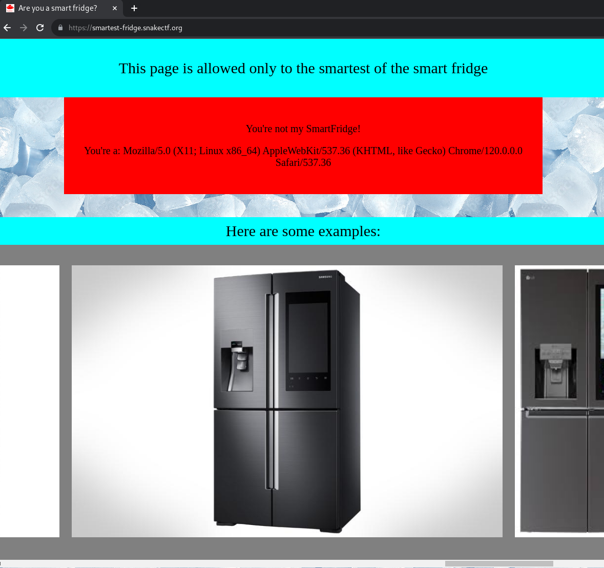

# smartest fridge [80 Solves]

## Description

> I love my smart fridge so much.
>
> <https://smartest-fridge.snakectf.org>

No attachment

## Flag

snakeCTF{w3lc0m3_t0_snakectf_w3bb3r}

## Solution

This challenge has not a Web Application Vulnerability.
The objective is to provide the expected User Agent.



Accessing the provided URL, the message `You're not my SmartFridge!` and my browser's User Agent is displayed.
Changing User Agent to `SmartFridge` to become `SmartFridge`.

```console
$ curl https://smartest-fridge.snakectf.org/ -A "SmartFridge"
<html>

<head>
    <link rel="stylesheet" href="css/main.css">
    <title>Are you a smart fridge?</title>
    <link rel="icon" type="image/x-icon" href="/pictures/huahei.png">
</head>

<body>
    <div class="welcome">
        <p>This page is allowed only to the smartest of the smart fridge</p>
    </div>
    <div class="error">
                <p>Oh you're a smart fridge! But.. Not my favorite brand :(</p>
                <p>You're a: SmartFridge</p>
                </div>    <br />
(snip)
```

The message was updated from `You're not my SmartFridge!` to `Oh you're a smart fridge! But.. Not my favorite brand :(`.
This challenge author's favorite brand is unknown.
However, the source code in HTML head section includes `/pictures/huahei.png`, it's HUAWEI.
I appended `HUAWEI` to User Agent.

```console
$ curl https://smartest-fridge.snakectf.org/ -A "SmartFridge HUAWEI"
<html>

<head>
    <link rel="stylesheet" href="css/main.css">
    <title>Are you a smart fridge?</title>
    <link rel="icon" type="image/x-icon" href="/pictures/huahei.png">
</head>

<body>
    <div class="welcome">
        <p>This page is allowed only to the smartest of the smart fridge</p>
    </div>
    <div class='success'>
                <p>
                    <b>*brrr*</b>... Here's your flag: snakeCTF{w3lc0m3_t0_snakectf_w3bb3r}
                </p>
(snip)
```

Got the flag.
